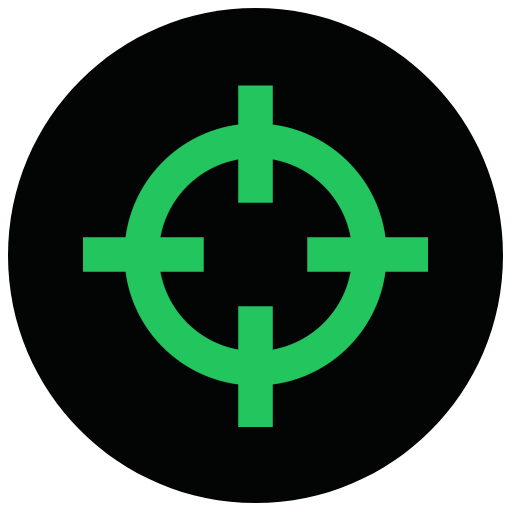

<div align="center">


<h1>Dotline</h1>
 
<p>A modern crosshair overlay</p>

</div>


## 📥 Download

### Windows

- [SourceForge](https://sourceforge.net/projects/dotline/) &ndash; NSIS installer & portable zip
- [parcoil.com](https://parcoil.com/dotline) &ndash; direct download

### Arch Linux

- `yay -S dotline`

### Ubuntu / Debian

- [parcoil.com](https://parcoil.com/dotline) &ndash; direct download
- [GitHub Releases](https://github.com/parcoil/dotline/releases) &ndash; AppImage & `.deb`

## ✨ Features

- 🎯 Customizable Crosshairs
- ✏️ Crosshair Editor
- 🖌 10+ Presets
- 📂 Import & Export your configs
- 🐧 Cross-Platform

### Tested Games

#### All games were tested on Windows 11 25H2

- CS2 ✅
- Rust ✅ (use Windowed fullscreen mode)
- Marvel Rivals ✅
- The Finals ✅
- Minecraft ✅

### Supported OSes

- Windows: ✅ (Tested on Windows 11 25H2, 24H2)
- Linux: ✅ (Tested on the following distributions)
  - Arch Linux on KDE
  - CachyOS on KDE
- MacOS ⚠️ (Seems to work. must build yourself, tested on MacOS sequoia)

> [!WARNING]  
> Dotline is in alpha, expect bugs, issues, missing features and frequent updates. feel free to open an issue if you find any. and please star the repo if you like it.

## ⚠️ Known Issues

- MacOS requires manual build, may not work on all versions.
- Linux window overlays may behave differently on Wayland vs X11.
- Does not work on Hyprland. may not work on other window managers

#### ⚠️ if the crosshair disapears in game try setting the game to windowed fullscreen mode.

### 🎯 Adding Preset Crosshairs

Preset crosshairs are located in `src/renderer/src/lib/presets.ts`.

> [!NOTE]
> This is only to add default presets. to create your own for personal reasons dotline has an in app editor.

To add your own:

1. Open `presets.ts`
2. Copy one of the existing objects in the `presets` object
3. Modify the `name`, `style`, `color`, `thickness`, etc to ur liking.
4. Save and take a look at your new preset.
5. Commit and make a pull request.

Example:

```ts
{
  name: 'My Awesome Crosshair',
  config: { ...defaultConfig, style: 'dot', color: '#ff00ff', creator: 'YourName' }
}
```

## 🛠️ Building Dotline

### Prerequisites

- Node.js v22
- pnpm
- a 64-bit version of Windows, Linux or MacOS

### Install

```bash
$ pnpm install
```

### Development

```bash
$ pnpm dev
```

### Build

```bash
# For windows
$ pnpm build:win

# For macOS
$ pnpm build:mac

# For Linux
$ pnpm build:linux
```
